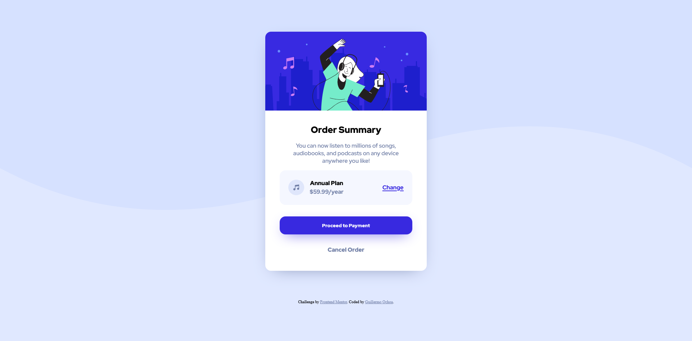

# Frontend Mentor - Order summary card solution

This is a solution to the [Order summary card challenge on Frontend Mentor](https://www.frontendmentor.io/challenges/order-summary-component-QlPmajDUj). Frontend Mentor challenges help you improve your coding skills by building realistic projects. 

## Table of contents

- [Overview](#overview)
  - [The challenge](#the-challenge)
  - [Screenshot](#screenshot)
  - [Links](#links)
- [My process](#my-process)
  - [Built with](#built-with)
  - [What I learned](#what-i-learned)
- [Author](#author)

## Overview

### The challenge

Users should be able to:

- See hover states for interactive elements

### Screenshot

### Links

- [Solution](https://www.frontendmentor.io/solutions/order-summary-solution-SpJgVL8wR)
- [Live Site](https://guillermoom.github.io/ORDER-SUMMARY-GOM)

## My process

### Built with

- Semantic HTML5 markup
- CSS custom properties
- Flexbox

### What I learned

For this challenge I learned about applying backgrounds to web pages using CSS, also more about customizing buttons and alignment of items using divs

## Author

- Frontend Mentor - [@GuillermoOM](https://www.frontendmentor.io/profile/GuillermoOM)
